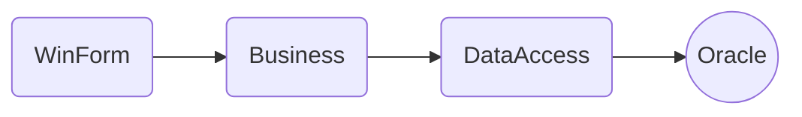
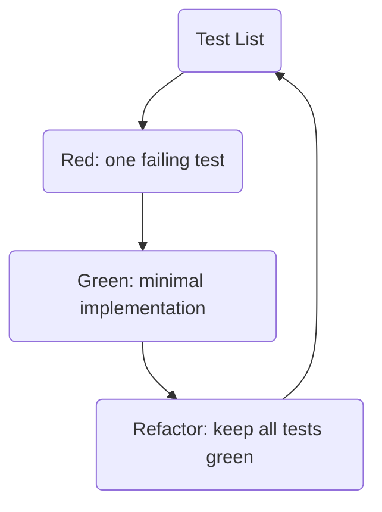
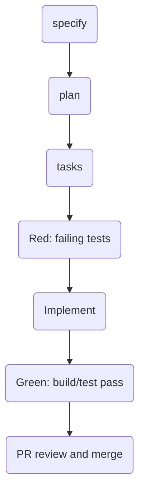

<!--
Sync Impact Report
- Version change: 1.0.0 -> 1.1.0
- Modified principles:
	- III. テスト先行品質ゲート -> III. t_wada流TDD品質ゲート
- Expanded sections:
	- 技術・品質制約（C#/.NETベストプラクティス追記）
- Added sections:
	- 技術・品質制約
	- 開発ワークフロー
- Removed sections: なし
- Templates requiring updates:
	- ✅ .specify/templates/plan-template.md（追加更新なし）
	- ✅ .specify/templates/spec-template.md（追加更新なし）
	- ✅ .specify/templates/tasks-template.md（追加更新なし）
	- ✅ .specify/templates/commands/*.md（対象ファイルなし）
- Follow-up TODOs: なし
-->

# attendance-management Constitution

## Core Principles

### I. レイヤ責務分離

WinForm 層、Business 層、DataAccess 層は責務を厳密に分離しなければならない。WinForm
層は SQL 実行と業務判定を行ってはならない。Business 層は UI 制御を行ってはならない。
DataAccess 層は業務判定を行ってはならない。責務混在は保守性低下と障害調査難化を招くため、
すべての変更でレビュー時に層境界を検証する。

### II. 仕様駆動とトレーサビリティ

すべての機能実装は spec.md、plan.md、tasks.md の順で成果物を確定してから開始しなければ
ならない。実装タスクは最低 1 つのユーザーストーリーと機能要件に紐付けなければならない。
要件に対応しないコードは原則追加禁止とし、例外は plan.md の Complexity Tracking へ理由を
明記する。これによりスコープ逸脱を防止する。

### III. t_wada流TDD品質ゲート

新機能と不具合修正は、t_wada が紹介する Kent Beck の定義に沿った TDD ワークフローで
進めなければならない。すなわち「テストリストを作る」「項目を1つだけ選んで失敗テストを
書く」「最小実装で成功させる」「必要に応じてリファクタリングする」を繰り返す。

実施上の必須ルールを次に定める。

- Red/Green/Refactor を 1 サイクルずつ完了させるまで、次のテストを増やしてはならない。
- テストを成功させる工程でリファクタリングを混在させてはならない。
- リファクタリングは全テスト成功状態でのみ実施しなければならない。
- Business 層と DataAccess 層の変更では単体テストを必須とし、層間契約変更では統合テストを
  追加しなければならない。
- Pull Request は `dotnet test` 成功を満たさない限りマージしてはならない。

テストは品質そのものを直接高める魔法ではなく、設計と実装を改善するための高速フィード
バック装置として扱う。手段の目的化を禁止する。

### IV. 可観測性と運用診断性

障害解析に必要なログは構造化されていなければならない。例外ログには発生箇所、入力文脈、
相関可能な識別子を含める。ユーザー操作起点の主要処理は開始・終了・失敗を追跡可能にする。
可観測性が不足する変更は受け入れない。運用診断の再現時間短縮を目的とする。

### V. 日本語ドキュメントと mermaid 可視化

プロジェクトで新規作成または更新する設計・運用ドキュメントは日本語で記述しなければならない。
さらに、構成・処理フロー・責務分担を説明する文書では mermaid 図を積極的に用いる。
文章のみで誤解が生じる箇所は図示を必須とする。可視化により認識齟齬を減らす。

## 技術・品質制約

- 言語と基盤は C# / .NET 8 / WinForms を標準とし、逸脱時は事前合意を必須とする。
- コーディング規約は StyleCop と Directory.Build.props の設定に従い、警告ゼロを維持する。
- 命名規約は PascalCase/camelCase を維持し、インデントは 4 スペースを使用する。
- データアクセスは Oracle 前提で実装し、SQL と接続制御は DataAccess 層に集約する。
- C# コーディングは Microsoft Learn の推奨に従い、以下を必須とする。
  - `using` は名前空間宣言の外側に配置する。
  - 原則としてファイルスコープ名前空間を使用する。
  - `var` は右辺から型が明確な場合にのみ使用する。
  - I/O バインド処理では `async`/`await` を使用する。
- 例外処理は .NET 公式ベストプラクティスに従い、以下を必須とする。
  - 通常制御に例外を使わず、可能な箇所は `Try*` API を優先する。
  - 例外再スローは `throw;` を使い、スタックトレースを欠落させない。
  - 引数検証は同期で行い、`ArgumentNullException.ThrowIfNull` 等を優先する。
  - `finally` で新たな例外を発生させない。

## 開発ワークフロー

1. `/speckit.specify` でユーザーストーリーと受け入れ条件を確定する。
2. `/speckit.plan` で技術方針、構造、憲章適合性を確認する。
3. `/speckit.tasks` でストーリー単位に実装順序と並列可否を定義する。
4. テスト失敗を確認してから実装し、`dotnet build` と `dotnet test` を通す。
5. Pull Request で憲章チェック項目を満たすことをレビューで確認する。

## Governance

この憲章は本リポジトリの開発規約に優先する上位規範である。改定提案は Pull Request として
提出し、変更理由、影響範囲、関連テンプレート更新有無を明記しなければならない。改定は
少なくとも 1 名以上のレビュー承認後に有効となる。

バージョニング方針は Semantic Versioning に従う。

- MAJOR: 既存原則の削除、または後方互換性のない再定義。
- MINOR: 新原則や新セクション追加、既存規範の実質拡張。
- PATCH: 意味を変えない明確化、誤記修正、表現改善。

コンプライアンスレビューは、すべての PR で実施しなければならない。レビュー項目には
責務分離、トレーサビリティ、テスト有無、ログ設計、ドキュメント日本語化と mermaid 図の
妥当性を含める。

**Version**: 1.1.0 | **Ratified**: 2026-06-21 | **Last Amended**: 2026-06-21
