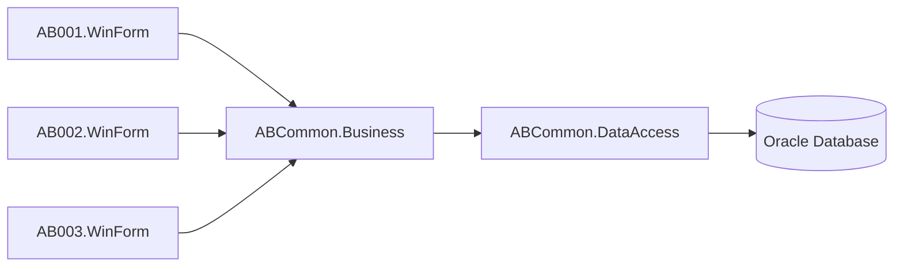

# 勤怠管理システム

## 概要

C# / .NET 8 / WinForms / Oracle
を利用した勤怠管理システム開発を目的としたプロジェクトです。

## 目的

本プロジェクトの目的は、社員・管理者・システム管理者それぞれが必要な機能を利用できる
勤怠管理システムを提供し、勤怠業務を正確かつ効率的に運用できるようにすることです。

- AB001.WinForm: 社員向けにログイン、社員検索、勤怠登録、勤怠照会を提供する
- AB002.WinForm: システム管理者向けに社員管理、マスタ管理を提供する
- AB003.WinForm: 管理者向けに部門別勤怠確認、承認処理を提供する

これにより、申請から承認までの業務を役割ごとに適切に分担し、
入力ミスの削減、確認作業の迅速化、運用ルールの統一を実現します。

## システム構成



## フォルダ構成

```text
attendance-management/
    ├ AB001.sln                          # 社員向け勤怠アプリケーション
    ├ AB002.sln                          # システム管理者向けアプリケーション
    ├ AB003.sln                          # 管理者向けアプリケーション
    │
    ├ db/                                # データベース定義
    │ └ migrations/                      # DDLマイグレーション
    │
    ├ scripts/                           # セットアップスクリプト
    │ ├ create_projects.bat              # プロジェクト作成スクリプト
    │ └ deploy_db.bat                    # DB展開スクリプト
    │
    ├ src/                               # ソースコード
    │ ├ AB001.WinForm/                   # 社員向け勤怠アプリ
    │ ├ AB002.WinForm/                   # システム管理者向けアプリ
    │ ├ AB003.WinForm/                   # 管理者向けアプリ
    │ ├ ABCommon.Business/               # 共通業務ロジック層
    │ └ ABCommon.DataAccess/             # 共通データアクセス層
    │
    ├ tests/                             # テストプロジェクト
    │ ├ ABCommon.Business.Tests/         # Businessテスト
    │ └ ABCommon.DataAccess.Tests/       # DataAccessテスト
    │
    ├ README.md                          # プロジェクト説明
    ├ Directory.Build.props              # ビルド設定
    └ stylecop.json                      # コード品質ルール
```

## 技術スタック

| 項目           | 内容                          |
| -------------- | ----------------------------- |
| 言語           | C#                            |
| Framework      | .NET 8                        |
| UI             | Windows Forms                 |
| DB             | Oracle                        |
| ORM/DBアクセス | Oracle.ManagedDataAccess.Core |
| Logging        | Serilog                       |
| Test           | xUnit                         |
| 品質管理       | StyleCop                      |

## アプリケーション一覧

### AB001.WinForm

社員向け勤怠アプリ

予定機能:

- ログイン
- 社員検索
- 勤怠登録
- 勤怠照会

### AB002.WinForm

システム管理者向けアプリ

予定機能:

- 社員管理
- マスタ管理

### AB003.WinForm

管理者向けアプリ

予定機能:

- 部門別勤怠確認
- 承認処理

## 開発ルール

### 命名

- クラス名：PascalCase
- メソッド名：PascalCase
- 変数名：camelCase

### レイヤ責務

| レイヤ     | 担当                       | 禁止                    |
| ---------- | -------------------------- | ----------------------- |
| WinForm    | 画面表示、ユーザー操作受付 | SQL、業務判断           |
| Business   | 業務ルール、処理制御       | UI直接操作、SQL直接実行 |
| DataAccess | Oracle接続、SQL実行        | 業務判断、画面制御      |
